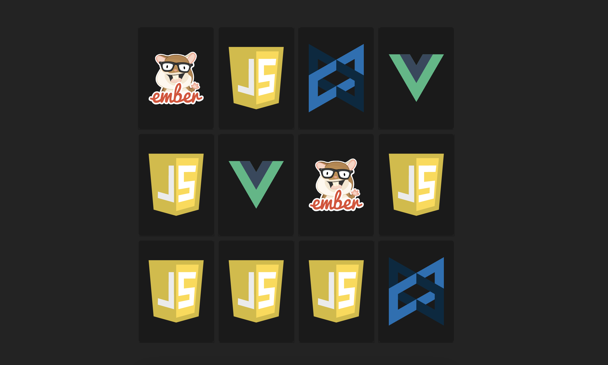

# About this simple memory game

You have to find and memorize cards of the same shape. If you find all the cards correctly, you will win.

        

# Installation

1. `npm i card-memory-game`
2. `import {Game} from 'am-card-memory-game' `
3. use ` <Game />` component
